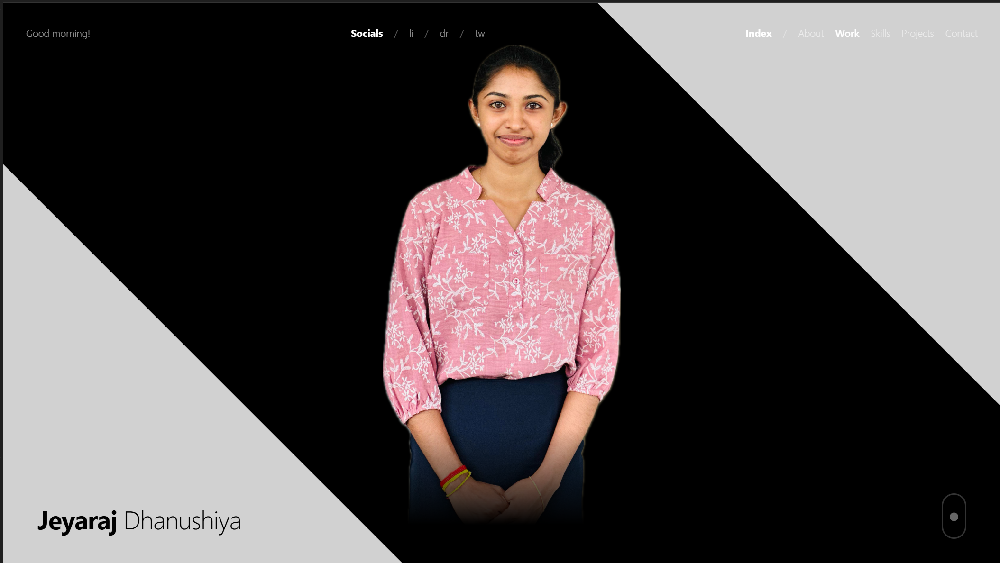

# 🚀 3D Animated Portfolio Website

A complete, production-ready 3D animated portfolio website for a creative software developer.



## 🛠️ Tech Stack

- **Framework:** React 18+ with TypeScript
- **3D Engine:** Three.js via `@react-three/fiber` + `@react-three/drei`
- **Styling:** Tailwind CSS v4
- **Animation:** Framer Motion + GSAP
- **Build Tool:** Vite

## 🚀 Features

- **Interactive 3D Hero:** Dynamic particle field that responds to mouse movement.
- **3D Tech Balls:** Skills represented as floating 3D spheres with tech logos.
- **Glassmorphism UI:** Modern, sleek design with backdrop blurs and semi-transparent backgrounds.
- **Vertical Timeline:** Elegant display of work experience.
- **GitHub Integration:** Fetches and displays real repository data.
- **Contact Form:** Fully functional contact form with EmailJS integration.
- **Responsive Design:** Optimized for mobile, tablet, and desktop.
- **Performance Optimized:** Uses `instancedMesh`, lazy loading, and efficient 3D rendering.

## 📦 Getting Started

1. **Clone the repository:**
   ```bash
   git clone <repo-url>
   ```

2. **Install dependencies:**
   ```bash
   npm install
   ```

3. **Set up EmailJS:**
   - Create an account at [EmailJS](https://www.emailjs.com/).
   - Get your `service_id`, `template_id`, and `public_key`.
   - Update these values in `src/components/sections/Contact.tsx`.

4. **Run the development server:**
   ```bash
   npm run dev
   ```

## 🎨 Customization

- **Colors:** Update the `@theme` block in `src/index.css`.
- **Content:** Modify `src/constants/index.ts` to update your personal info, projects, and experience.
- **3D Models:** Add your own `.glb` models to `public/assets/models/` and update the components in `src/components/canvas/`.

## 📄 License

This project is licensed under the MIT License.
